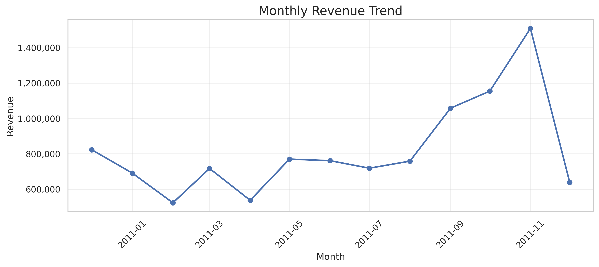
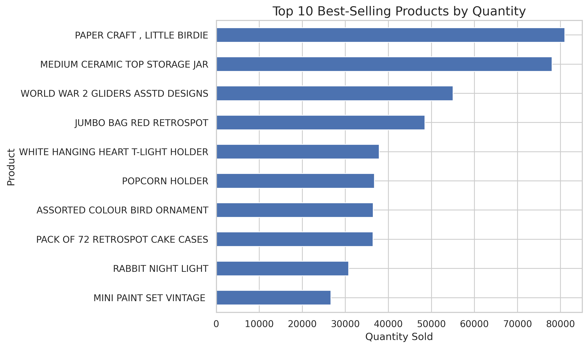
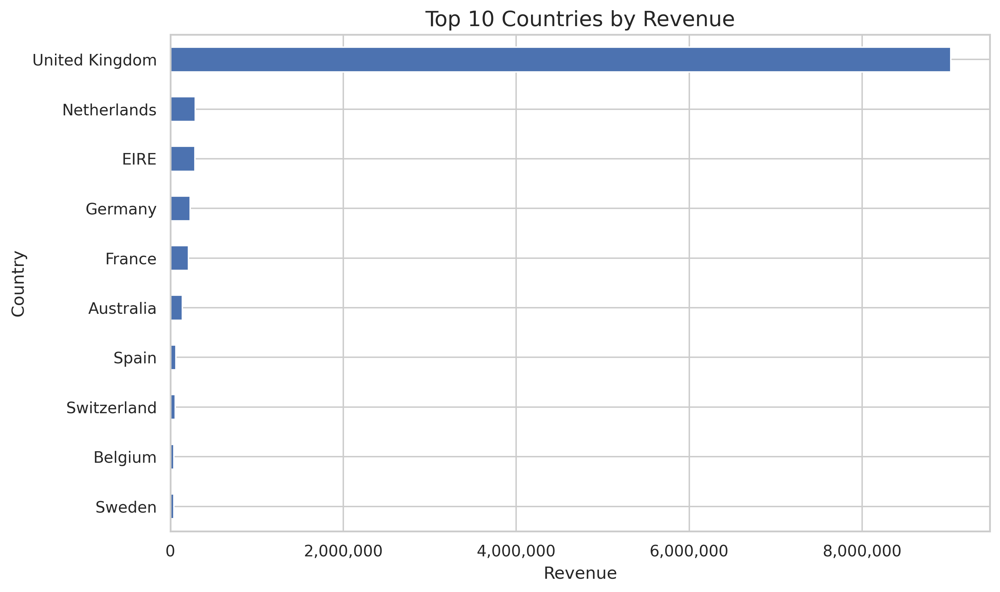
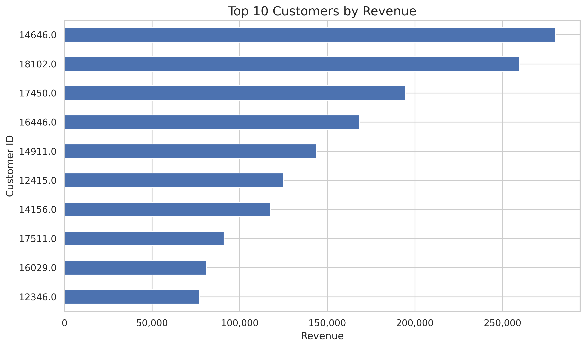
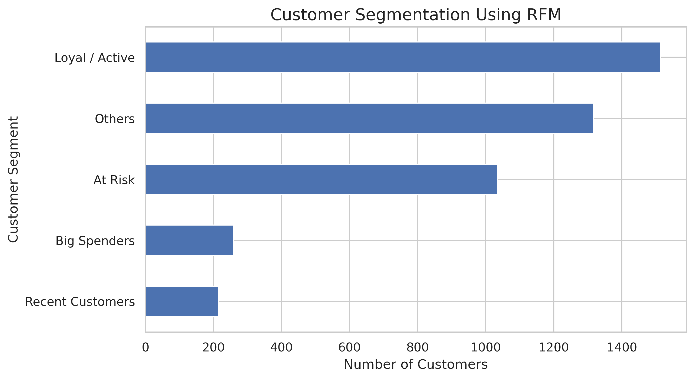

# E-Commerce Sales & Customer Behavior Analysis Using Python

## Project Overview
This project analyzes the UCI Online Retail dataset using Python to understand sales performance, product demand, and customer purchasing behavior.

## Objectives
- Analyze monthly sales and revenue trends.
- Identify top-selling products.
- Compare revenue across countries.
- Identify high-value customers.
- Segment customers using RFM analysis.
- Develop data-driven business recommendations.

## Dataset
**Source:** [UCI Machine Learning Repository — Online Retail](https://archive.ics.uci.edu/dataset/352/online+retail)

The dataset contains transactions from a UK-based online retailer between December 2010 and December 2011.

## Tools & Technologies
- Python
- Pandas
- Matplotlib
- Google Colab
- Jupyter Notebook
- GitHub

## Project Structure
- `01_Data_Cleaning` — Data preparation and quality checks
- `02_Exploratory_Data_Analysis` — Initial data exploration
- `03_Sales_Analysis` — Sales and revenue analysis
- `04_Customer_Analysis` — Customer purchasing behavior
- `05_RFM_Segmentation` — Recency, Frequency, and Monetary analysis
- `06_Visualizations` — Generated charts
- `07_Business_Insights` — Findings and recommendations

## Visualizations
The `06_Visualizations` folder contains charts covering:
- Monthly revenue trends
- Top 10 products by quantity sold
- Top 10 countries by revenue
- Top 10 customers by revenue
- RFM customer segments

## Key Findings
The analysis of the UCI Online Retail dataset revealed the following findings:

- **Total Revenue:** £10,666,684.54 in recorded sales revenue.
- **Best-Performing Month:** November 2011, with revenue of £1,509,496.33.
- **Top Country:** The United Kingdom generated the highest revenue.
- **Best-Selling Product:** PAPER CRAFT , LITTLE BIRDIE had the highest total quantity sold.
- **Unique Customers:** The dataset contains 4,338 unique customers with recorded customer IDs.
- **Total revenue generated in November 2011:** It is approximately 14.15%.
- ## Key Findings

## Business Recommendations

1. **Sales Planning:** Investigate the strong performance in November 2011 to identify seasonal demand patterns and opportunities for future campaigns.
2. **Inventory Management:** Monitor demand for best-selling products to support stock planning.
3. **Market Strategy:** Analyze UK sales patterns and customer preferences to maintain performance in the largest market.
4. **Customer Retention:** Use RFM segmentation to identify loyal customers and customers who may need re-engagement.
5. **Data-Driven Decisions:** Track monthly revenue, product demand, and customer purchasing behavior to support business planning.

*Note: Revenue and customer metrics depend on the data-cleaning rules applied. Product rankings here are based on total quantity sold, not revenue.*

## Business Recommendations

1. **Sales Planning:** Investigate the strong performance in November 2011 to identify seasonal demand patterns and opportunities for future campaigns.
2. **Inventory Management:** Monitor demand for best-selling products to support stock planning.
3. **Market Strategy:** Analyze UK sales patterns and customer preferences to maintain performance in the largest market.
4. **Customer Retention:** Use RFM segmentation to identify loyal customers and customers who may need re-engagement.
5. **Data-Driven Decisions:** Track monthly revenue, product demand, and customer purchasing behavior to support business planning.

## Business Recommendations
Recommendations will be based on the analysis results and may include inventory planning, targeted marketing, and customer retention strategies.

## How to Run
1. Clone or download this repository.
2. Open the Jupyter Notebook in Google Colab or Jupyter Notebook.
3. Load the dataset from the UCI source.
4. Run the notebook cells in order.

## Author
Project created as part of a Python data analysis portfolio.
## Visualizations

### 1. Monthly Revenue Trend

### 2. Top 10 Best-Selling Products

### 3. Top 10 Countries by Revenue

### 4. Top 10 Customers by Revenue

### 5. Customer RFM Segmentation

